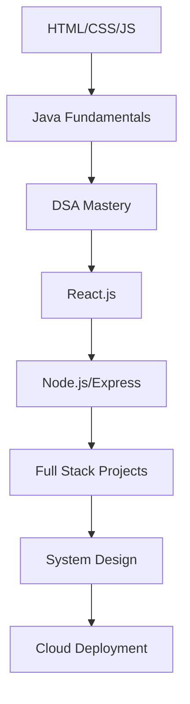

# <div align="center"></div>

<div align="center">
  
</div>

<div align="center">
  
  <br>
  
</div>

##  **✨ About Me**


```javascript
✨ const samiksha = {
    name: "Samiksha Nilesh Raut",
    pronouns: "She/Her",
    location: "India 🇮🇳",
    currentRole: "✨ Frontend Developer & Digital Artist",
    currentFocus: "🌸 Full Stack Development & DSA Mastery",
    aesthetic: "💫 Minimalist with a touch of magic",
    
    technologies: {
        frontend: ["🦋 JavaScript", "🌸 HTML5", "💜 CSS3", "🎀 TailwindCSS"],
        backend: ["☕ Java", "🐍 Python", "🟢 Node.js"],
        databases: ["🔮 Oracle", "🍃 MySQL", "🍀 MongoDB"],
        tools: ["🌟 Git", "🐧 Linux", "🎨 VS Code", "💎 Arduino"],
        learning: ["⚛️ React.js", "🌺 Spring Boot", "🐳 Docker"],
        dreams: ["✨ TypeScript", "☁️ AWS", "🚀 GraphQL"]
    },
    
    vibes: {
        favoriteTime: "🌙 Midnight coding sessions",
        musicStyle: "🎵 Lo-fi & Aesthetic playlists",
        coffeeLevel: "☕ Always brewing",
        debuggingMood: "🦋 Patient & persistent"
    },
    
    motto: "✨ Code with elegance, dream with purpose, create with love 💖"
};
```

<br clear="both">

##  **What I'm up to**


- 🔭 Currently working on **innovative web applications & open source projects**
- 🌱 Deep diving into **Data Structures & Algorithms in Java**
- 🎯 Learning **React.js ecosystem & modern web technologies**
- 👯 Open to collaborate on **exciting frontend/fullstack projects**
- 🤝 Seeking guidance in **system design, scalability & best practices**
- 📫 Reach me at **samiksha220306@gmail.com**
- 💬 Ask me about **web development, Java programming, or tech in general**
- ⚡ Fun fact: **I can debug code for hours and still smile! 😄**
- 🎮 When not coding: **Reading tech blogs, playing chess, or exploring new places**

<br clear="both">

##  **🌸 Connect & Follow**

<div align="center">

[](https://linkedin.com/in/samiksha-raut)
[](https://github.com/samikshar1)
[](mailto:samiksha220306@gmail.com)
[](https://your-portfolio-link.com)
[](https://twitter.com/samiksha_dev)
[](https://dev.to/samikshar1)

</div>

##  **💫 Tech Arsenal**

<div align="center">

### **✨ Programming Languages**


### **🌸 Frontend Development**


### **🦋 Backend & Database**


### **🌟 Tools & Technologies**


</div>escript&logoColor=white)

### **Frontend Development**


### **Backend & Database**


### **Tools & Technologies**


### **Data Science & Analytics**


</div>

##  **💖 GitHub Analytics**

<div align="center">
  
  
  
</div>

<div align="center">
  
</div>

##  **Contribution Graph**

<div align="center">
  
</div>

## 🏆 **Achievement Showcase**

<div align="center">
  
</div>

##  **Coding Journey**

<div align="center">

### **2024 Goals** 🎯
- [x] Master Data Structures & Algorithms
- [x] Build 5+ Frontend Projects  
- [ ] Contribute to Open Source (In Progress)
- [ ] Learn React.js Ecosystem
- [ ] Deploy First Full-Stack App
- [ ] Start Tech Blog

### **Learning Path** 📚


</div>

##  **Featured Projects**

<div align="center">

[](https://github.com/samikshar1/portfolio-website)
[](https://github.com/samikshar1/java-dsa-practice)

[](https://github.com/samikshar1/frontend-projects)
[](https://github.com/samikshar1/web-development-bootcamp)

</div>

##  **Weekly Development Breakdown**

<!--START_SECTION:waka-->
```text
JavaScript   8 hrs 45 mins   ████████████░░░░░░░░░░░░░   48.32%
Java         4 hrs 32 mins   ██████░░░░░░░░░░░░░░░░░░░   25.14%
HTML/CSS     2 hrs 15 mins   ███░░░░░░░░░░░░░░░░░░░░░░   12.47%
Python       1 hr 20 mins    ██░░░░░░░░░░░░░░░░░░░░░░░   7.41%
Others       1 hr 12 mins    █░░░░░░░░░░░░░░░░░░░░░░░░   6.66%
```
<!--END_SECTION:waka-->

##  **Fun Facts & Hobbies**


- 🌟 **First line of code:** Hello World in C (2020)
- ☕ **Coffee addiction level:** Expert (5+ cups/day)
- 🎵 **Coding soundtrack:** Lo-fi hip hop & instrumental music
- 🌙 **Peak productivity hours:** 10 PM - 2 AM
- 📖 **Favorite tech books:** Clean Code, Design Patterns
- 🎮 **Gaming:** Chess, Strategy games
- 🌍 **Dream destination:** Silicon Valley tech hubs
- 🎯 **2024 Resolution:** Contribute to 10+ open source projects
- 🏆 **Proudest moment:** Solving my first dynamic programming problem
- 🤔 **Debugging style:** Rubber duck debugging + lots of console.logs

<br clear="both">

##  **Latest Blog Posts**

<!-- BLOG-POST-LIST:START -->
- [Understanding JavaScript Closures: A Beginner's Guide](https://dev.to/samikshar1/javascript-closures)
- [My Journey Learning Data Structures in Java](https://dev.to/samikshar1/dsa-java-journey)
- [5 CSS Tricks Every Frontend Developer Should Know](https://dev.to/samikshar1/css-tricks)
- [Building Responsive Layouts with TailwindCSS](https://dev.to/samikshar1/tailwind-layouts)
<!-- BLOG-POST-LIST:END -->

##  **Support My Work**

<div align="center">

If you like my work and want to support me, you can:

[](https://buymeacoffee.com/samikshar1)
[](https://ko-fi.com/samikshar1)
[](https://paypal.me/samikshar1)

⭐ **Star my repositories if you find them helpful!**

</div>

##  **Let's Collaborate!**

<div align="center">

### 🚀 **Open for opportunities in:**
**Frontend Development • Full Stack Projects • Open Source Contributions • Mentorship**


[](https://github.com/samikshar1)
[](https://github.com/samikshar1)

</div>

---

<div align="center">

### 💭 **Quote of the Day**


**"The only way to do great work is to love what you do." - Steve Jobs**

### 🎵 **Currently Listening To**
[](https://open.spotify.com/user/samikshar1)

</div>


---

<div align="center">

**Thank you for visiting my profile! Happy Coding! 🚀**

*Last updated: September 2025*

</div>
