```mermaid
graph TD
    A[🔭 Working on xyz] --> B[🌱 Learning DSA in Java]
    B --> C[👯 Open to collaborate on abc]
    C --> D[🤝 Looking for help with sam]
    D --> E[💬 Ask me about Frontend Development]
    E --> F[📫 Reach me: samiksha220306@gmail.com]
    
    style A fill:#00D4FF,stroke:#fff,stroke-width:2px,color:#000
    style B fill:#00D4FF,stroke:#fff,stroke-width:2px,color:#000
    style C fill:#00D4FF,stroke:#fff,stroke-width:2px,color:#000
    style D fill:#00D4FF,stroke:#fff,stroke-width:2px,color:#000
    style E fill:#00D4FF,stroke:#fff,stroke-width:2px,color:#000
    style F fill:#00D4FF,stroke:#fff,stroke-width:2px,color:#000
```

<div align="center">


</div>

---

##  **About Me**

<table>
<tr>
<td width="50%">

```typescript
interface Developer {
  name: string;
  role: string;
  location: string;
  currentFocus: string;
  skills: string[];
  passion: string;
}

const samiksha: Developer = {
  name: "Samiksha Nilesh Raut",
  role: "Frontend Developer",
  location: "India 🇮🇳",
  currentFocus: "DSA in Java",
  skills: [
    "JavaScript", "Java", "Python", 
    "HTML5", "CSS3", "TailwindCSS",
    "Git", "Linux", "Arduino"
  ],
  passion: "Creating beautiful user experiences"
};

// Current Status
const status = {
  workingOn: "xyz",
  learning: "Data Structures & Algorithms",
  collaborateOn: "abc",
  helpWith: "sam",
  askAbout: "Frontend Development",
  reachMe: "samiksha220306@gmail.com"
};
```

</td>
<td width="50%">

<div align="center">

</div>

</td>
</tr>
</table>

---

##  **Tech Stack**

<div align="center">

<table>
<tr>
<td align="center" width="120">

<br><strong>Java</strong>
</td>
<td align="center" width="120">

<br><strong>JavaScript</strong>
</td>
<td align="center" width="120">

<br><strong>Python</strong>
</td>
<td align="center" width="120">

<br><strong>C++</strong>
</td>
<td align="center" width="120">

<br><strong>C</strong>
</td>
</tr>
<tr>
<td align="center" width="120">

<br><strong>HTML5</strong>
</td>
<td align="center" width="120">

<br><strong>CSS3</strong>
</td>
<td align="center" width="120">

<br><strong>Tailwind</strong>
</td>
<td align="center" width="120">

<br><strong>Git</strong>
</td>
<td align="center" width="120">

<br><strong>Linux</strong>
</td>
</tr>
<tr>
<td align="center" width="120">

<br><strong>Oracle</strong>
</td>
<td align="center" width="120">

<br><strong>Arduino</strong>
</td>
<td align="center" width="120">

<br><strong>Pandas</strong>
</td>
<td align="center" width="120">

<br><strong>VS Code</strong>
</td>
<td align="center" width="120">

<br><strong>More...</strong>
</td>
</tr>
</table>

</div>

---

##  **GitHub Statistics**

<div align="center">


</div>

<div align="center">
<br>

</div>

<br>

<div align="center">

</div>

---

##  **Achievements**

<div align="center">

</div>

---

##  **Let's Connect**

<div align="center">

<table>
<tr>
<td align="center">
<a href="https://github.com/samikshar1">

<br><strong>GitHub</strong>
</a>
</td>
<td align="center">
<a href="https://linkedin.com/in/samiksha-raut">

<br><strong>LinkedIn</strong>
</a>
</td>
<td align="center">
<a href="mailto:samiksha220306@gmail.com">

<br><strong>Email</strong>
</a>
</td>
<td align="center">
<a href="https://your-portfolio.com">

<br><strong>Portfolio</strong>
</a>
</td>
</tr>
</table>

<br>

[](https://github.com/samikshar1)
[](https://linkedin.com/in/samiksha-raut)
[](mailto:samiksha220306@gmail.com)
[](https://your-portfolio.com)

</div>

---

##  **Current Focus**

<div align="center">



</div>

---

<div align="center">


###  **"Code is poetry written for machines to understand"**


[](https://github.com/samikshar1)

**Thanks for visiting! Let's build something amazing together! 🚀**


</div>
